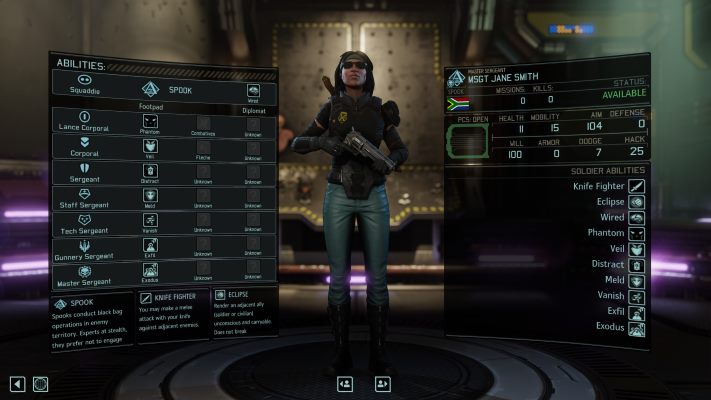
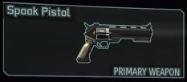
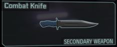

# Spook Class

The Spook is a new soldier class for vanilla XCOM 2, for use with Long War 2.

[Enlarge image](XCom2SpookClass/Media/Docs/Armory.jpg)

*"Spooks conduct black bag operations in enemy territory. Experts at stealth, they prefer not to engage enemies directly."*

Spooks are not a combat-oriented class. They are best deployed solo, where they can readily complete certain classes of mission alone or in small groups with other Spooks, especially once reaching a high rank.

This mod is not compatible with War of the Chosen, nor LWOTC. It is also incompatible with other mods which make equally substantial changes to concealment mechanics, such as Peek from Concealment.

All content is subject to future balance tweaks and other changes without notice.

## Weapons

### Spook Pistol

*"A sidearm carried exclusively by Spooks, they favour this pistol over larger, more powerful but cumbersome weapons."*

In the unlikely event that the Spook wishes to engage in combat, the Spook Pistol is extremely accurate at close range, even versus enemies in cover. It is quick to fire, encouraging mobility. It is also deeply inaccurate at longer ranges, and lacks significant upgrades at higher weapon tiers.

**Conventional** 4 damage, +2 on a crit, short sound range, unlimited ammo. 1 action to fire.

**Magnetic** 6 damage, +3 on a crit, short sound range, unlimited ammo. 1 action to fire.

### Combat Knife 

*"A lightweight secondary melee weapon. A knife attack requires one action and does not end your turn."*

## Perks: Footpad

**Wired** (SQ)

 *"Cannot be panicked, stunned, disoriented or rendered unconscious. Drones can rarely detect you."*

**Phantom** (LCPL) (Per XCOM 2)

*"When the squad is revealed, this soldier remains concealed."*

**Veil** (CPL)

 *"Enemies' detection range is reduced, depending on your rank."*

**Distract** (SGT)

*"Distract nearby enemies toward a target location. Does not break concealment."* 2 charges per mission.

**Meld** (SSGT) 

*"Retain concealment next to high cover and objectives."* Passively triggered when in a suitable location.

**Vanish** (TSGT) 

*"Release a smoke cloud, gain concealment and a free concealed move action."* Free to activate, with 2 charges per mission. 

**Exfil** (GSGT) 

*"Release a smoke cloud and immediately exit the AO."* 

**Exodus** (MSGT) 

*"Release a smoke cloud. All allies within this area immediately exit the AO."*

## Perks: (Middle Tree)

**Knife Fighter** (SQ)  (Per Long War 2)

*"You may make a melee attack with your knife against adjacent enemies."*

**Combatives** (LCPL) (Per Long War 2)

*"You may parry melee attacks and counterattack with your melee weapon. Also gain +10 dodge."*

**Fleche** (CPL) (Per Long War 2)

*"Attack any enemy within movement range with your combat knife."*

## Perks: Diplomat

**Eclipse** (SQ) 

*"Render an adjacent ally (soldier or civilian) unconscious and carryable. Does not break concealment."*

## Perks: Spook Pistol

**Dart**

*"Fire a dart which causes bleeding. Does not break concealment."* 3 darts per mission. Inflicts 1 damage (2 on a crit), then 1-4 damage per turn, biased towards 2-3.

## Perks: GTS

**Exeunt** (CPL) 

*"Evac times are reduced by 1 turn for each Spook on a mission, to a minimum of 1 turn. If only Spooks are on a mission, evac is 1 turn."*

Costs 15 Supplies, then available to all Spooks.

**Operator** (SSGT) 

*"Interacting with objects and objectives, knocking people out, and picking up and putting down bodies are free actions and will not end your turn."*

Costs 25 Supplies, then available to all Spooks.

## Acquiring Spooks

Rookies do not automatically become Spooks after ranking up.

One Spook can be obtained from a new Point of Interest on the Geoscape, immediately upon starting  a new game.

Further Spooks can be trained in the GTS.

## New/Unusual Mechanics

* **Wired** effectively reduces Drone detection range to zero, for Spooks only. This is unlike all other classes, where detection range is fixed for the detector and apply to all victims, and detection modifiers are fixed for the victim and apply to all detectors. Some rather unusual ability triggers are employed to ensure that concealment-breaking tiles and "Gotcha Again" style pathing indicators are correctly updated. The Wired modifier is visible as a debuff applied to enemy drones... only during the player's turn.

* **Veil** grants a rank-dependent stat bonus, so higher ranked Spooks receive a greater detection modifier, further reducing enemies' detection range.

* **Meld** and **Vanish** grant an effect internally known as Shade, which has a custom visual effect (temporarily altering soldier pawn component materials, and later restoring them) and renders the soldier undetectable for its duration. In the case of Meld, Shade is only applied at the end of the player's turn and lasts until the start of the next turn, and requires the Spook to be in high cover or adjacent to certain kinds of objective. In the case of Vanish, it only lasts for the bonus move.

* **Distract** is capable of temporarily redirecting AI even at green alert and without affecting their alert status, and cannot use the base game's AI alert mechanic since those alerts are long lasting and hence somewhat hard to control. The mod achieves this by modifying enemy AI behaviour trees to prioritise potential distractions. Distract grants 2 uses of a temporary "distract grenade" to the Spook for each tactical battle. Since units entering red alert need to no longer be distracted, the base game effect which applies red alert to units is overridden, and its visualiser is modified to inform the player that the relevant enemies are no longer distracted.

* **Dart** will cause damaged enemies to reach yellow alert, but not red alert. This is the only damage type which does not cause enemies to immediately enter red alert, since that behavior is built-in to the base game. Members of the target's patrol group are informed of an unusual "sound" coming from the target in order to generate the yellow alert. In addition, enemies which die from the bleed effect caused by Dart do not cause the patrol AI to hang. The unfortunate enemy is removed from his patrol group upon death, and the patrol group elect a new leader. This is all transparent to the player.

* **Operator** grants Spooks unique variations of standard perks with reduced cost and which do not break concealment. The mod achieves this through pre-mission ability template substitutions for Spooks with the Operator perk, rather global modifications to the base game ability templates at startup. Further, Operator permits Spooks to carry more than one loot item during Long War 2 Smash'N'Grab missions, and to collect them all without breaking concealment. As well as overriding the standard quest item pickup rules for the mission, the mod has to employ custom evac handling to ensure that bonus loot is awarded for each extra quest item the Spook is carrying, since mssion Kismet only awards one loot item per soldier upon evac. Since the number of maps for Smash'N'Grab is quite limited, and resources are critical in Long War 2, this is intended as a rebalancing mechanic.

* **Eclipse** allows Spooks to knock out VIPs, including during VIP extraction missions. This does mean that high ranking Spooks complete these missions rather easily, on turn one (punch out the VIP, pick them up, and immediately exit the AO). This is intended to allow players to focus on more interesting missions in the late game.

* **Exfil** and **Exodus** both permit units to exit the AO without evac, but with all the usual effects of evac intact.

* The mod's various concealment-retaining mechanics are achieved by completely supplanting the base game's handling of unit sight of other units and the breaking of concealment, in order to introduce exceptions.
